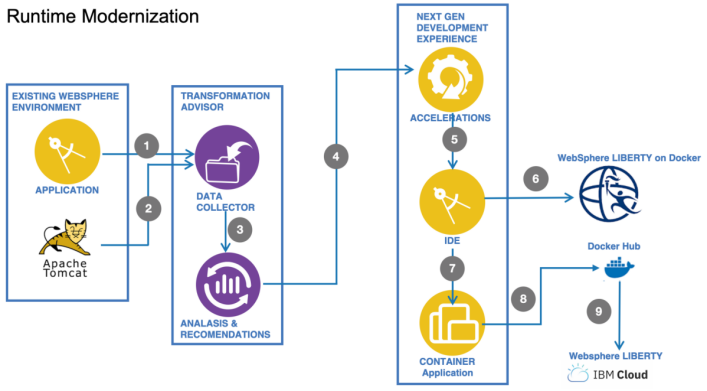

# Apache Tomcat Examples for Cloud Native Post Academy Deep Dive

개발자 확습 코스에 온것을 환영합니다.

이 예제는 현재 사용하고 있는 Web Application을 클라우드 Native Application을 전환하는 것을
학습하는 과정입니다.

현 시스템을 Cloud TA(Transformation Advisor)를 도구를 이용하여 전환작업을 수행하며
아래의 과정으로 클라우드 Native Application Developer가 필요로 하는 역량을 경험하고자 합니다.

  * Transformation Advisor 및 리포팅 정보 활용
  * Application 오류 수정
  * Build war 
  * 현 Application 을 컨테이너화
  * 현 Application 클라우드 컨테이너 플랫폼의 IKS 환경에 배포

이번 학습코스는 아래와 같은 과정을 수행합니다. TA 리포팅정보를 기반으로
오류를 해결하여 IKS에 배포하십시요




## Docker Base Image
```
FROM websphere-liberty
```

## git 에서 소스를 받아서 sts에 import 하십시요
아래 github에서 source 받아서 sts tool에서 반입(Import)하십시요
  https://github.com/ibm-cloudacademy/academy.git 


Existing Projects into Workspace를 선택


select archive file을 선택


github에서 받은 academy.zip 파일을 선택


finish 버튼을 클릭


반입된 소스는 에러가 발생할 것이다 
Transformation Advisor가 reporting한 정보를 기반으로 에러를 수정


pom 파일선택


maven install


result war file


